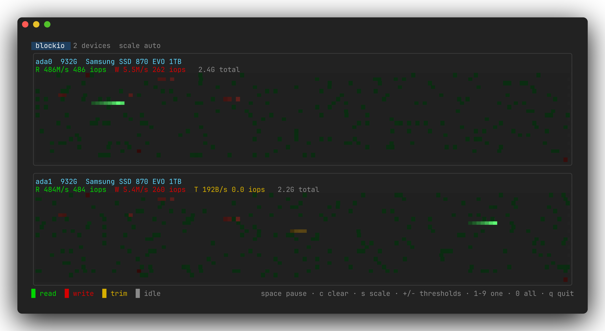

# blockio — watch the disks the way DOS defrag did

`blockio` is a Go + [bubbletea](https://github.com/charmbracelet/bubbletea) /
[lipgloss](https://github.com/charmbracelet/lipgloss) front-end to whatever
the kernel will say about block I/O — FreeBSD's DTrace `io` provider, macOS's
`fs_usage(1)`: one pane per device, one cell per slice of the address space,
**green for reads, red for writes, amber for TRIM**. A resilver, a scrub or a
big sequential read draws a bright head marching across the map; scattered
metadata writes speckle it; an idle disk sits dark.

```
sudo blockio                 # pick devices from a list, all preselected
sudo blockio ada0 ada1       # watch these (disk0 disk3 on macOS)
sudo blockio -a              # every disk, without asking
sudo blockio -l              # list the disks and exit
blockio -demo 8              # synthetic devices, no root needed
go test ./...                # unit tests
man ./blockio.8              # manual page
```

It needs root everywhere. On FreeBSD it reads `dtrace(1)` and `diskinfo(8)`,
so it also wants the DTrace modules: `kldload dtraceall`, or
`dtraceall_load="YES"` in `/boot/loader.conf`. On macOS it reads `fs_usage(1)`
and `diskutil(8)`, and needs nothing turned off — see [macOS](#macos).



Both halves of a ZFS mirror under a real workload: five seconds at about
450MB/s, mostly scattered reads, with a band of writes running through them
and one sequential streak. `doc/screenshot.sh` regenerates it: `-once` prints
a frame, `freeze` turns it into a PNG.

## The map

Each pane is one device. Cell 0 is LBA 0 in the top left, and cells run left
to right and top to bottom, so the whole device always fits the pane however
large it is. Position is by byte offset against the media size the system
reports — `diskinfo(8)` on FreeBSD, `diskutil(8)` on macOS — which is why a
`zpool scrub` reads as a band sweeping down the pane and a random workload
reads as noise.

Resolution comes from two numbers:

- **Buckets** — how finely each device is split before the display ever sees
  it: by DTrace's aggregation on FreeBSD, by the accumulator that folds
  `fs_usage` lines into frames on macOS. Every I/O lands in
  `offset * buckets / mediasize`, so this is the ceiling on detail.
  `-buckets` defaults to about as many as the terminal can draw (rounded up
  to a power of two, clamped to 256–16384). It is fixed for the run: make the
  window much bigger and the map stays as coarse as it started, until you
  restart.
- **Cells** — how many the _pane_ has. With half blocks (`-half`, on by
  default) every terminal row carries two rows of cells: the top half in the
  foreground color, the bottom half in the background one, so a pane is twice
  as tall in data as it is in rows.

Each cell carries two layers. **Activity** fades with a half-life of
`-decay` (500ms), so the bright part of the map is what the disk is doing
right now. Under it a dimmer **trail** fades with a half-life of `-trail`
(60s), showing where the head has been: the tail behind a scrub, the region a
database keeps rewriting. `-trail off` turns it off, `c` clears both.

The pane header gives the device, its size, what the system calls it, and the
current read, write and TRIM rates in bytes and operations per second.

## Hot and cold

Cell brightness comes from the cell's byte rate, and there are two ways to
turn a rate into a color:

| Scale            | What a color means                                                                                                                                                   |
| ---------------- | -------------------------------------------------------------------------------------------------------------------------------------------------------------------- |
| `auto` (default) | measured against that device's own busiest cell, square-root scaled — a quiet disk still shows structure, but colors are not comparable between devices or over time |
| `fixed`          | measured against `-thresholds`, so the same color always means the same rate, on every device, in every frame                                                        |

`-thresholds 64K,512K,4M,32M` are bytes per second **per cell**, ascending,
one to eight of them; the ramp is stretched over however many are given, and
`K`, `M`, `G` suffixes are binary. Because a cell covers a slice of the
device rather than the whole of it, useful thresholds are much smaller than
the device's total throughput.

`s` switches between the two live, `+` and `-` double and halve the
thresholds (and switch to `fixed`, since that is what they scale). The header
says which is in force.

## Color depth

`-color` picks the depth, `auto` by default (`NO_COLOR` is honored):

| Mode        | Rendering                                                                   |
| ----------- | --------------------------------------------------------------------------- |
| `truecolor` | a continuous gradient per cell — the decay looks smooth rather than stepped |
| `256`       | five steps per command through the color cube                               |
| `16`        | dim and bright of green, red and yellow                                     |
| `off`       | no escapes at all: `·` for the trail and `░▒▓█` for rising activity         |

Half blocks need a background color, so `-color off` renders full rows.

## Keys

| Key                    | Action                                              |
| ---------------------- | --------------------------------------------------- |
| `space` / `p`          | pause (the map freezes, the source keeps running)   |
| `c`                    | clear the map and the totals                        |
| `s`                    | switch the color scale between `auto` and `fixed`   |
| `+` / `-`              | double / halve the thresholds (switches to `fixed`) |
| `1`–`9`                | show one device full screen; the same key returns   |
| `0` / `a`              | show all of them again                              |
| `q` / `esc` / `ctrl+c` | quit                                                |

## Layouts

Panes go in one column for one or two devices and two columns above that, so
three devices sit in the four-pane layout, five in the six-pane one, and
seven in the eight-pane one:

```
1 device     2 devices    3-4 devices  5-6 devices  7-8 devices
+---------+  +---------+  +----+----+  +----+----+  +----+----+
|         |  |         |  |    |    |  |    |    |  |    |    |
+---------+  +---------+  +----+----+  +----+----+  +----+----+
             |         |  |    |    |  |    |    |  |    |    |
             +---------+  +----+----+  +----+----+  +----+----+
                                       |    |    |  |    |    |
                                       +----+----+  +----+----+
                                                    |    |    |
                                                    +----+----+
```

## Devices

Given names (`blockio ada0 ada1`, with or without `/dev/`), those are what it
watches. Given none, it offers a multiselect list of every whole disk, all
preselected but the disk images; `-a` skips the question and takes the lot.
That list is `kern.disks` filtered by what answers `diskinfo(8)` on FreeBSD,
and `diskutil(8)`'s whole disks on macOS. Devices without media are left out,
so an empty `cd0` never shows up. `-l` prints the list and exits.

## macOS

macOS has DTrace too, but not out of the box: System Integrity Protection
hides every kernel probe, so `io:::start` matches nothing at all until SIP is
relaxed from recoveryOS. The default backend is therefore `fs_usage(1)`,
which reports the same kdebug events the buffer cache raises for every
completed I/O:

```
13:02:55.798868  WrData[A]  D=0x0e2db501  B=0x100000 /dev/disk3s5  big.bin
```

`D` is a block number in the whole disk's address space and `B` is the byte
count, which is everything the map needs. It costs a line down a pipe per
I/O, where the D script costs an aggregation the kernel keeps, but it works
on a machine nobody has had to reboot.

Two things read differently here:

- **The busy disk is a synthesized one.** An APFS volume's I/O is reported
  against the container it lives in (`disk3s5` → `disk3`), never the physical
  disk underneath, so a laptop's `disk0` sits dark while `disk3` does all the
  work. `-l` lists both and says which is which.
- **There are more devices than disks.** macOS synthesizes one per APFS
  container and two per mounted disk image, so one SSD and a few Xcode
  simulator runtimes come to fourteen entries. The images are listed but
  start unselected in the picker; `-a` still watches everything.
- **There is no TRIM.** Unmap does not travel through the buffer cache, so
  neither backend can see it and the amber layer stays empty.

`-source dtrace` is there for a machine that has had SIP relaxed —
`csrutil enable --without dtrace` from recoveryOS, which on Apple silicon
wants the security policy lowered to Reduced Security first. It is the finer
of the two, since the kernel does the aggregating, and the less travelled:
SIP is on by default, so `fs_usage` is the path that gets the mileage.

macOS carries the Solaris io provider rather than FreeBSD's, so it is a
different D program: `args[0]` is a translated `bufinfo_t`, the direction is
`b_flags & B_READ`, the size is `b_bcount`, and the position is `b_blkno` in
device blocks. Devices have to be keyed by minor number, because the
`devinfo_t` translator in `/usr/lib/dtrace/io.d` still ships as

```d
dev_name = "??"; /* XXX */
dev_statname = "??"; /* XXX */
```

Every minor a disk answers to (`disk3`, `disk3s1`, `disk3s1s1`, ...) maps to
the same pane, since they all report blocks in the whole disk's address
space.

## Configuration

`~/.config/blockio/config` (`$XDG_CONFIG_HOME/blockio/config`, or
`$BLOCKIO_CONFIG`) holds defaults, one `option = value` per line, `#`
comments:

```
color = truecolor       # auto, truecolor, 256, 16, off
scale = fixed           # auto or fixed
thresholds = 64K,512K,4M,32M
decay = 500ms           # half-life of activity
trail = 2m              # half-life of the trail, or off
half = on               # two rows of cells per terminal row
buckets = 8192          # slices per device
interval = 100ms        # sampling interval
source = fsusage        # auto, dtrace, fsusage (macOS)
```

Flags override the file. Unknown keys and bad values are warned about, never
fatal.

## Options

| Flag          | Meaning                                         |
| ------------- | ----------------------------------------------- |
| `-a`          | watch every disk, without asking                |
| `-l`          | list the disks and exit                         |
| `-i`          | sampling interval (default 100ms)               |
| `-color`      | `auto`, `truecolor`, `256`, `16`, `off`         |
| `-scale`      | `auto` or `fixed`                               |
| `-thresholds` | hot/cold steps, bytes per second per cell       |
| `-decay`      | half-life of activity on the map                |
| `-trail`      | half-life of the trail, `0` for none            |
| `-buckets`    | slices per device (0 fits the terminal)         |
| `-half`       | half blocks: two rows of cells per terminal row |
| `-source`     | `auto`, `dtrace`, `fsusage` (macOS)             |
| `-demo`       | synthesize N devices instead of tracing         |
| `-once`       | sample for a while, print one frame, exit       |
| `-for`        | how long `-once` samples (default 2s)           |
| `-size`       | frame size for `-once` (default 100x30)         |

`-demo` needs neither root nor disks: it fabricates a sweep, scattered writes
and a busy region, which is the easy way to look at the layouts and the color
modes. `-once` prints a single frame to stdout and exits, for scripting or
for pasting into a bug report.

## The dtrace scripts

The same data, without the TUI. FreeBSD only: both read `struct bio` and
`struct devstat`, which is not what the io provider hands you on macOS.

```sh
sudo dtrace -s iosum.d                  # totals by device and command
sudo dtrace -s iosum.d -c "sleep 5"     # for five seconds
sudo dtrace -s iosum.d ada0,ada1        # only these
sudo ./iosnoop.sh                       # one line per I/O, every device
sudo ./iosnoop.sh ada0                  # only this one
```

`iosnoop.d` prints exec, device, command, size, LBA, position and latency per
I/O, then per-device totals and a latency histogram. `iosnoop.sh` wraps it
with the geometry from `diskinfo(8)`, which the `io` provider's disk layer
does not carry, so the LBA and POS columns can be filled in; run the `.d`
file directly and they fall back to 512-byte sectors and `-`.

## How it works

On FreeBSD, at startup `diskinfo(8)` is asked about each device and the answers are baked
into a generated D script as an `int64_t media[]` table, together with a
`track[]` table of the devices to watch. Every `io:::start` is aggregated
into `@cells[device, command, bucket]`, and a `tick` clause prints the
aggregation and truncates it, which the Go side folds into the display. Only
touched buckets are printed, so an idle disk costs nothing.

`fs_usage` has no aggregation to offer and no notion of a frame, so on macOS
the Go side keeps both: every line is folded into a
`map[device, command, bucket]` under a mutex, and a ticker drains it into a
frame at the sampling interval. Both backends hand the display the same
`Frame`, which is all it knows about either.

## Notes on the FreeBSD io provider

Five things about `io:::start` on FreeBSD are worth writing down, all of them
learned the hard way here:

- `args[0]` and `args[1]` are **not** translated: they arrive as
  `struct bio *` and `struct devstat *`, so `args[0]->b_bcount` does not
  compile. Cast them, or wrap each use in `xlate<bufinfo_t *>()`.
- The size of an I/O is `bio_length`. `bio_bcount` is a buf layer field and
  reads 0 at the GEOM layer.
- `devinfo_t`'s `dev_statname` is only the device name, with no unit number,
  so a `dev_statname == "ada0"` predicate never matches. Use `device_name`
  together with `unit_number`.
- Every logical I/O is seen twice, once at the GEOM layer and once at the
  disk layer. The GEOM layer leaves `devstat` empty and carries the name on
  `bio_to->name` instead. `blockio` traces only the disk layer, so nothing is
  counted twice; `iosnoop.d` shows both and labels them.
- Geometry must come from the same layer as the name: a disk layer bio can
  point at a much smaller provider, and mixing the two reports I/O at 25000%
  of the device.

And one about D itself: its `int` is 32 bits, so a media size does not fit in
one. `int64_t` or the number wraps, silently.

## Tests

`go test ./...` covers the parsing of dtrace's output and of the generated
script, the reading of an `fs_usage` line and the frame it accumulates into, the threshold and color-mode parsers, the ramp (that reads come out
green and writes red, that a 256-color index is not emitted as an ANSI code,
that fixed thresholds ignore the peak), the half-block rows and the pane
layout. None of it needs root or a terminal.

## License

BSD 2-Clause, see `LICENSE`.
